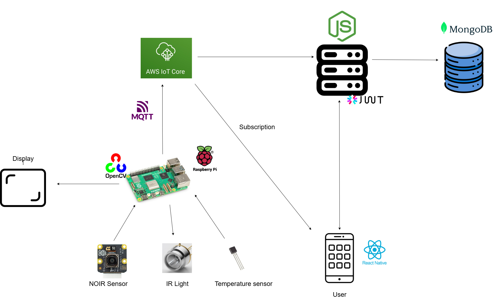

[comment]: # "This is the standard layout for the project, but you can clean this and use your own template"

# Project Title

---

## Team
-  E/20/248, T.L.B Mapagedara, [email](mailto:e2024@eng.pdn.ac.lk)
-  E/20/158, J.G.C Jananga, [email](mailto:e2024@eng.pdn.ac.lk)
-  E/20/453, R.J Yogesh, [email](mailto:e2024@eng.pdn.ac.lk)
-  E/20/300, H.A.M.T Prasadinie, [email](mailto:e2024@eng.pdn.ac.lk)

## Supervisor
- Dr. Isuru Nawinne, [email](mailto:isurunawinne@eng.pdn.ac.lk)

<!-- Image (photo/drawing of the final hardware) should be here -->

<!-- This is a sample image, to show how to add images to your page. To learn more options, please refer [this](https://projects.ce.pdn.ac.lk/docs/faq/how-to-add-an-image/) -->

<!--  -->

#### Table of Contents
1. [Introduction](#introduction)
2. [Solution Architecture](#solution-architecture )
3. [Hardware & Software Designs](#hardware-and-software-designs)
4. [Testing](#testing)
5. [Detailed budget](#detailed-budget)
6. [Conclusion](#conclusion)
7. [Links](#links)

## Introduction

VascuEye is a medical imaging system that utilizes near-infrared (NIR) technology to detect arteries and assist in both preoperative planning and post-surgical inspection for oral and facial surgeries. By providing real-time visualization of blood vessels, the system helps surgeons avoid accidental arterial damage and simplifies post-surgical monitoring to detect complications like hematomas or poor blood circulation.

### Applications & Benefits
- ✅ Enhanced Surgical Accuracy – Helps avoid arterial damage during procedures.
- ✅ Faster & Easier Post-Surgical Inspection – Reduces reliance on manual monitoring.
- ✅ Real-Time Blood Flow Monitoring – Detects complications early.
- ✅ Portable & Affordable Solution – More accessible than high-end imaging devices.
- ✅ Remote Monitoring Support – Enables telemedicine and second opinions.

## Solution Architecture

## Hardware and Software Designs

Detailed designs with many sub-sections

## Testing

Testing done on hardware and software, detailed + summarized results

## Detailed budget

All items and costs

| Item                            | Quantity | Unit Cost   | Total     |
|---------------------------------|:--------:|:-----------:|----------:|
| Temperature Sensor (DHT22)      | 1        | Rs. 450.00  | Rs. 450.00|
| Raspberry Pi 4 Model B         | 1        | Rs. 20400.00| Rs. 20400.00|
| Raspberry Pi NoIR Camera Sony IMX219 | 1   | Rs. 7200.00 | Rs. 7200.00|
| IR LEDs (850nm)                 | 10       | Rs. 200.00  | Rs. 2000.00|
| IR LEDs (940nm)                 | 10       | Rs. 200.00  | Rs. 2000.00|
| 5 Inch LCD Display              | 1        | Rs. 10500.00| Rs. 10500.00|
| Wires and Other Electronic Components | -    | Rs. 1000.00 | Rs. 1000.00|
| Power Bank (10000 mAh)          | 1        | Rs. 2500.00 | Rs. 2500.00|
| **Total Price**                 |          |             | **Rs. 42450.00**|

## Conclusion

What was achieved, future developments, commercialization plans

## Links

- [Project Repository]((https://github.com/cepdnaclk/e20-3yp-Vascueye)){:target="_blank"}
- [Project Page](https://cepdnaclk.github.io/{{ page.repository-name}}){:target="_blank"}
- [Department of Computer Engineering](http://www.ce.pdn.ac.lk/)
- [University of Peradeniya](https://eng.pdn.ac.lk/)

[//]: # (Please refer this to learn more about Markdown syntax)
[//]: # (https://github.com/adam-p/markdown-here/wiki/Markdown-Cheatsheet)
